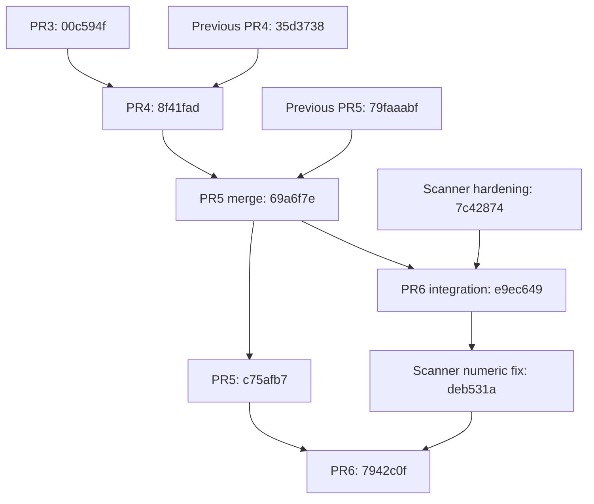

# APEX baseline attestation — MFF

**Assessment date: 2026-10-04. Status: BASELINE RECORDED / CROSS-REPOSITORY GATE BLOCKED.**

This document records Program A lineage reconciliation and its evidence for `ThugLyfe02/scorpion-mff-stack`. The cross-repository semantic contract probe passed at the published source heads. The companion Stock Finder research-line full-suite CI exposed reproducibility failures, so the overall prerequisite remains blocked. Its private attestation contains those exact heads, logs and missing-input details. This is not an APEX milestone declaration, a deployment approval, or evidence of profitable trading. No advanced quantitative implementation or prospective-performance claim is made here.

Stock Finder's private lineage belongs in its companion attestation. Only the shared public research contract is identified here.

## 1. Exact source identity and lineage

The published heads below were checked out detached for verification. Each final capture reports an unchanged head, source files, probe, and golden fixture, with no tracked modifications. CI checks out `${{ github.event.pull_request.head.sha || github.sha }}`; its result is tied to the literal PR head, rather than only GitHub's synthetic merge commit.

| PR / branch | Audited head before reconciliation | Published verified head | Passing tests | Exact-head successful CI |
| --- | --- | --- | ---: | --- |
| #3 `hardening/calibrated-semantic-acceleration` | `bfa36a3a1e5512b18e3e3906e535231fd9a65805` | `00c594fb2b9b477c8ae9286d8aa2d4d6f64cfcf5` | 78 | [37186529897](https://github.com/ThugLyfe02/scorpion-mff-stack/actions/runs/37186529897) |
| #4 `hardening/adversarial-audit-intelligence` | `35d37388fc3b182f2e167c9a6abdecf66bcf6c45` | `8f41fadac3bcac545246119aca08e83fed4a9fa4` | 168 | [37186778700](https://github.com/ThugLyfe02/scorpion-mff-stack/actions/runs/37186778700) |
| #5 `hardening/performance-tournament-intelligence` | `79faaabf1ff33e37c8d31b72b28ef2744d478598` | `c75afb7b08730e7cc7cd6fba67760d550645e67d` | 482 | [37187826994](https://github.com/ThugLyfe02/scorpion-mff-stack/actions/runs/37187826994) |
| #6 `integration/scanner-context-v1` | `9f17d43f3f70d508278370b33e44b014d3cadfa4` | `7942c0ff59689c7d11a78c972c22a65da7c54626` | 536 | [37187826632](https://github.com/ThugLyfe02/scorpion-mff-stack/actions/runs/37187826632) |

The [initial DAG](apex/program-a/initial-branch-dag.json.gz) and [post-reconciliation DAG](apex/program-a/post-branch-dag.json.gz) retain commit parents and ancestry. The unchanged lower branch heads were main `edcbde869e137de7423df0a62e02e8c152fc4b28`, deterministic control `007390782929840222278d6717fa2531ea01dfb0`, and precision intelligence `8bf471004a9f87ec352470c1a325b9c87ba64f55`.

PR4 included an older PR3 ancestor, not PR3's newest sentinel/halt hardening. PR5 likewise omitted newer PR4 admitted-state and execution-truth work; PR6 inherited those omissions. Reconciliation preserved existing branches through explicit merges:

PR4's merge parents are the previous PR4 and final PR3 heads. PR5 merge `69a6f7e831b0a31fd346504a1078225f400e15d7` has parents previous PR5 and final PR4; it is followed by SQLite hardening `ea2327cc923985d74795380506ed42e74c5e3486` and benchmark correction `c75afb7`. Final PR6 merges `deb531a1e2d91185efaa39b25c9a5e7bce609357` with final PR5. Git ancestor checks confirm final PR3 is contained in PR4, PR4 in PR5, and PR5 in PR6. These lower-layer gaps are closed at the listed heads.

## 2. Strategy, parser, policy, and scanner fingerprints

The source/policy SHA-256 values below come from the final capture manifests; the scanner fingerprint is the declared shared semantic contract checked by the producer/consumer verification.

| Identity | Heads / scope | Fingerprint |
| --- | --- | --- |
| Locked source strategy | `live/RULES.lock.md`, all four heads | `b5a132d73ebe52cfb12e4903966cdf170428306940b5fa5d12c24b0717a8c1e0` |
| Parser source | PR3, parser `v2` | `d401105d37fdbd32aab2a712920d493ae1e8670c5e4c928bf8a161e0e003e92c` |
| Parser source | PR4–6, parser `v3` | `ef94460e71f7bdfe3dbaec2df2e0ea67e8e4b421924bebb2a60bedef4510829b` |
| Captured policy payload | PR3–4, `DEFAULT_POLICY` only | `74d82ce3d8805e1c8510cab1314d14eecbf81b0d1b7fb089f2a7edddc194fb7e` |
| Native runtime-policy fingerprint | PR5–6, `RuntimePolicyBundle`, `runtime-policy-v1` | `c13fdc64c5a49b455a7a3b5544e51b8699d7636d9f059013bc9c3fe4b61bacfb` |
| Captured policy payload | PR5–6; includes capture scope, distinct from native identity | `63ad5fdd5ac582a067959c409cd75ccb23e4cad6cdebbd03b8ea84f099a24a87` |
| Scanner semantic contract | `scorpion.scanner-observation.v1`; batch `scorpion.scanner-batch.v1` | `e314fa3a571debc97e54e7aa1c8e810fe4766c64ad0e98d49e3f49781ef89f7c` |

The base policy is unchanged across these captures, including `live_submission_enabled=false`. Parser versions differ between existing PR3 and PR4 capabilities; reconciliation does not silently equate them. The locked strategy artifact remains identical. Scanner confidence remains a ranking heuristic and scanner authority remains `RESEARCH_ONLY`.

## 3. Verified invariants and intentional behavior changes

CI passed `ruff check src tests`, strict `mypy src/scorpion`, and pytest at each listed head. These are the actual scoped gates; unrelated historical artifacts are not certified globally lint-clean.

| Promise / correction | Named regression evidence |
| --- | --- |
| A halt committed after the admission read blocks the whole normalized transaction | `tests/test_transactional_pipeline.py::test_halt_committed_after_admission_blocks_the_entire_transaction`; `test_recovery_halt_race_preserves_all_pending_revisions` |
| Durable capture survives halt; normalization stops; restart respects the latch | `tests/test_integrity_sentinel.py::test_latched_halt_keeps_new_raw_durable_but_blocks_normalization`; `test_pending_recovery_does_not_run_while_halt_is_latched` |
| Divergence latches halt before telemetry; committed raw never becomes retryable after a post-commit failure | Same file: `test_divergence_is_durably_latched_before_telemetry_failure`; `test_post_commit_check_failure_preserves_done_and_halts_new_work`; `test_recovery_post_commit_failure_does_not_repend_committed_raw` |
| An earlier unresolved/quarantined revision cannot be bypassed | `tests/test_futureproofing_v09.py::test_recovery_stops_at_the_first_quarantined_failure`; `test_later_transition_cannot_bypass_an_earlier_failed_revision` |
| Replay uses durable processing order and effective policy | `tests/test_integrity_sentinel.py::test_sentinel_and_restart_use_the_effective_nondefault_policy`; `test_sentinel_uses_durable_process_order_when_source_sort_changes_capacity` |
| Observed history, admitted intent, and actual fills remain separate | Same file: `test_checkpoint_of_observed_history_cannot_admit_blocked_strategy_on_restart`; `tests/test_execution_journal.py::test_fill_truth_preserves_durable_admission_order_and_current_policy` |
| Restart preserves and rejects damaged effect evidence instead of regenerating it | `tests/test_integrity_sentinel.py::test_restart_preserves_damaged_effect_evidence_and_latches_halt`; `tests/test_execution_journal.py::test_tampered_fill_journal_fails_execution_truth_closed` |
| Mutating runtime connections restore their declared SQLite policy | `tests/test_runtime_sqlite_connections.py::test_runtime_writers_restore_connection_policy_before_mutation` (14 cases); `tests/test_execution_journal.py::test_execution_journal_sets_durability_pragmas_on_every_connection` |
| Scanner evidence cannot appear clean when quality is missing; non-finite confidence fails even with valid hashes | `tests/test_scanner_context_v33.py::test_absent_quality_attestation_cannot_appear_clean`; `tests/test_scanner_batch_v33.py::test_bundle_rejects_nonfinite_confidence_even_if_rehashed` |
| Static scanner imports do not reach control/dispatch, and control does not consume scanner research | `tests/test_scanner_authority_boundary.py::test_scanner_imports_cannot_reach_control_or_dispatch_modules`; indirect function-local import counterexample test |

The normalized transaction now checks durable halt and earlier unresolved receipt state under its writer lock. Failure handling distinguishes pre-commit work from committed evidence. Recovery stops on existing halt and first quarantine. The sentinel compares observed and admitted books under explicit policy/order; execution reconciliation separately reconstructs actual fills. Observed checkpoints do not confer eligibility, consume execution capacity, or prove filled positions. Missing/mutated effects trigger a halt rather than silent reconstruction.

**Authority impact: no authority added.** Admission becomes more restrictive where evidence/order is invalid. No live brokerage execution, deployment, source-strategy substitution, model promotion, or scanner-to-order adapter was introduced. Static import tests cover direct, transitive, and function-local Python imports in the current package. They are not formal proofs against reflection, dynamic loading, future adapters, or every possible call path.

## 4. Semantic differential replay: identical but incomplete

The same frozen probe and 40-case corpus were applied to each original/final pair. All four comparisons report **zero changed cases**, stable sources, the same probe/corpus, and `IDENTICAL_WITH_INCOMPLETE_CASES`. There are 39 complete cases and one retained incomplete case on each side. No golden classification mismatch occurred.

`malformed_expiry` contains `AAPL 200C 2026-02-30 @ 1.00`. Parsing raises `ValueError: day is out of range for month`. It is an unexpected parser exception, not a normalized refusal or completed replay. The other two exception steps are expected invalid-fill rejections. The malformed-date defect remains visible; equality of the same failure is not a successful semantic certification.

`VALID_CAPTURE` means capture identity remained stable. It does not turn `semantics.status=INCOMPLETE` into PASS. These finite source-reducer comparisons also do not independently prove all durable admission, recovery, or fill-state behavior; the targeted regressions above supply separate evidence.

## 5. Measured benchmark baseline

Every row uses **320 observations**, the same shared probe, monotonic `perf_counter_ns`, and nearest-rank quantiles. Values are **microseconds**. No timed samples are discarded. Semantic probes run before timing in `--mode all`; imports and parser state are therefore already warm. This is not a cold-start benchmark.

### Core parser / association / reducer / invariant compute

| Final head | p50 | p90 | p95 | p99 | p99.9 | max |
| --- | ---: | ---: | ---: | ---: | ---: | ---: |
| PR3 | 18.588 | 24.617 | 32.729 | 123.824 | 140.929 | 140.929 |
| PR4 | 29.674 | 36.705 | 48.622 | 101.381 | 136.122 | 136.122 |
| PR5 | 29.724 | 38.327 | 53.530 | 111.476 | 163.853 | 163.853 |
| PR6 | 30.465 | 84.185 | 124.926 | 202.371 | 237.012 | 237.012 |

### Durable `Pipeline.handle`, call through return

| Final head | p50 | p90 | p95 | p99 | p99.9 | max |
| --- | ---: | ---: | ---: | ---: | ---: | ---: |
| PR3 | 1,593.645 | 2,255.978 | 2,974.144 | 6,123.949 | 48,863.367 | 48,863.367 |
| PR4 | 1,880.370 | 2,313.012 | 2,676.462 | 5,507.945 | 8,792.079 | 8,792.079 |
| PR5 | 2,086.727 | 2,834.687 | 4,298.389 | 7,151.845 | 9,370.137 | 9,370.137 |
| PR6 | 2,381.825 | 3,509.458 | 5,946.075 | 10,146.370 | 38,039.639 | 38,039.639 |

### Before → reconciled, using the same comparable probe

| PR | Core p50 | Core p95 | Core p99 | Pipeline p50 | Pipeline p95 | Pipeline p99 |
| --- | ---: | ---: | ---: | ---: | ---: | ---: |
| #3 | 18.467 → 18.588 | 30.696 → 32.729 | 57.185 → 123.824 | 1,233.350 → 1,593.645 | 1,816.536 → 2,974.144 | 4,575.822 → 6,123.949 |
| #4 | 29.134 → 29.674 | 57.446 → 48.622 | 94.340 → 101.381 | 1,564.151 → 1,880.370 | 2,061.079 → 2,676.462 | 3,590.609 → 5,507.945 |
| #5 | 37.014 → 29.724 | 68.332 → 53.530 | 129.352 → 111.476 | 1,626.354 → 2,086.727 | 2,453.772 → 4,298.389 | 5,535.776 → 7,151.845 |
| #6 | 38.067 → 30.465 | 107.129 → 124.926 | 211.304 → 202.371 | 1,755.225 → 2,381.825 | 2,705.475 → 5,946.075 | 5,782.202 → 10,146.370 |

Original PR4–6 lacked the replay-integrity sentinel now present in their reconciled descendants. The measured change includes restored safety work; this is not a controlled estimate of any single repair's cost. Raw durations and every original quantile remain in the captures.

Core classification is exactly 107 ENTRY, 107 AMBIGUOUS, and 106 IGNORE per head. This is a small source-state workload, excluding eligibility/packet admission. The durable workload uses valid guild/author but a rejected channel: 320 raw records, 320 normalized signals, zero effects, no positions. It includes the synchronous sentinel crossing its configured 64-commit cadence five times; the retained counters are participation evidence, not separate sentinel timing. It excludes startup, quotes, network, and brokerage. It does not establish active-position, admitted-entry, or multi-year recovery latency.

Environment: AMD EPYC 9V74 80-Core Processor; nine visible/affinity CPUs; x86_64; Linux 6.18.44 / glibc 2.39; Python 3.13.15 (Clang 22.1.3); SQLite 3.53.1; `CLOCK_MONOTONIC`, nonadjustable, reported 1 ns resolution. Storage is an overlay filesystem with 4096-byte blocks; physical medium is unknown. External workload was not measured. One actual Store connection after each workload reports WAL/FULL/FK ON/5000 ms. Other writers require the separate connection audit.

At 320 observations, p99.9 equals the maximum; it is not a stable production-tail estimate. Single-run differences do not establish causal regressions or speedups. Historical native benchmarks used the wrong guild; corrected native v2 exercises different core and full-path rejection behavior. Native old/new speed ratios are invalid. Use the shared comparable probe for before/after observations; native reports remain supplementary, with their fixture-validity flag and source hash.

## 6. SQLite guarantee and explicit remaining writers

The runtime fix asserts `synchronous=FULL`, `foreign_keys=ON`, and `busy_timeout=5000` before mutation in Store, durable ingress, receipt/process ordering, quarantine, integrity initialization/verification, checkpoint writing, and execution-journal paths. It includes read-named functions that create/backfill schema. A deliberately weakened connection factory produced 12 failures plus two existing positive controls before the repair; all 14 cases pass afterward. This verifies connection policy before mutation, not physical power-loss durability.

Current SQLite defaults were already FULL/5000; missing assertions were a portability gap. Remaining separately scoped writers include delivery/release ledgers, the no-trade latch's DB side, production-gate and deployment registries, operator migrations, packet resolution, and backup destinations. `ProductionGateRegistry` currently lacks database-level FK enforcement despite application existence checks. HistoryArchive deliberately uses NORMAL/10000. Default flags on genuinely read-only checkpoint/admission readers are not writer failures. The complete path classification and limitations are in [the SQLite boundary audit](APEX_SQLITE_BOUNDARY_AUDIT.md).

## 7. Review findings, complexity, and strongest counterarguments

PR3's halt race, telemetry-before-latch, and post-commit retry defects were source-verified and fixed with regressions. PR4's older review findings were checked against actual code/tests before reconciliation, including negated actions, blocked eligibility/capacity, full effect integrity, and fill reconciliation. Scanner missing-quality and non-finite-confidence defects are fixed. Review-thread UI state was not automatically resolved: code verification and GitHub discussion resolution are separate facts. The final [review snapshot](apex/program-a/review-findings.json) records 3 unresolved threads on PR3, 12 on PR4, none on PR5, and 1 on PR6; their source-checked repairs do not automatically resolve those discussions.

Reconciliation deltas from the audited original heads are PR3 **+193/−18 across seven files**, PR4 **+434/−11 across seven**, PR5 **+3424/−162 across 53**, and PR6 **+3568/−167 across 58**. Larger descendants inherit previously existing lower-layer implementations. These are not thousands of new APEX algorithm lines. No package dependency was added. PR5 restores the pre-existing lower-layer `scorpion-record-fill` CLI; no unattended execution is added. The SQLite follow-up creates no new TCB source file. Relative to stale PR5/PR6, reconciliation restores three existing lower-layer source files (`execution_journal.py`, `execution_state.py`, `semantic_envelope.py`) that participate in execution truth. That is explicit inherited TCB growth, not a zero-growth claim. Runtime configuration and package dependency deltas are zero; the inherited fill-recording CLI adds one entry point. An exhaustive automated TCB-growth proof remains future work.

The strongest remaining objections are substantive:

- The malformed expiry still aborts parsing. The retained differential corpus is incomplete.
- Checkpoint, certification, and backup fingerprints concern observed source state; they do not certify the whole admitted/fill-state recovery system.
- Sentinel checks are synchronous and cadenced. Small-history benchmarks cannot establish large-history tail behavior or cross-process snapshot guarantees.
- Hash chains do not resist an adversary able to rewrite the entire database and all local anchors. Source hashes are not independent publisher authentication.
- Static authority checks are bounded tests; standalone administrative/delivery writers still have explicit policy gaps.
- Existing `backtest_overfit.py` can report PASS for malformed or uninformative numeric panels, including non-finite values; its rank normalization and combination work cap also require correction. **Existing PBO PASS results remain unvalidated and must not support trusted research claims until reviewed under the corrected method.** Preserve historical reports with an invalidated-current-trust annotation; repair and independently validate this in Program B-0 before using the quantitative tribunal. No PBO correctness or market-performance claim is granted by the passing software suite.

## 8. Cross-repository verification and evidence gate

The public evidence package is under `docs/apex/program-a/`: `captures/{original,reconciled}-pr{3..6}.json.gz` retains each complete capture, including raw timings; `semantic-diff-pr{3..6}.json` retains the classified comparisons; `ci/{mff3,mff4,mff5,mff6}.json.gz` retains API/job-log receipts and evidence lines. [Summary](apex/program-a/summary.json) and [manifest](apex/program-a/manifest.json) identify the packaged files. Gzip artifacts preserve the full JSON with deterministic zero modification time; manifest SHA-256 checks bind their bytes. The complete private cross-repository test evidence remains with the companion Stock Finder attestation. The real writer/loader round trip preserves hits-only versus full-universe coverage, explicit nonselection, causal ineligibility and research-only authority. It rejects rehashed live-authority rows/manifests, missing quality/blockers, future market evidence and tampered row/batch identities. Synthetic verification flags are test fixtures and do not attest to real provider truth.

The [frozen probe](apex/program-a/probes/apex_baseline_probe.py.gz), after decompression, has SHA-256 `0a3d5be865f021629054838e43278fc5dad270c70da8f98bd4c1d65ebe105633`; corpus SHA-256 is `dc27c31bc0e18ef28f289945be92ebe09e72986367ef04f128085f357291d1a5`. [Probe methodology](APEX_BASELINE_PROBE.md), [implementation map](APEX_IMPLEMENTATION_MAP.md), and [artifact verifier](../tools/verify_apex_evidence.py) explain reproduction and scope.

The evidence pack is checked by `python tools/verify_apex_evidence.py`, including a CI step on the attestation PR. Its successful exit certifies retained bytes; its output continues to report the blocked baseline gate. The attestation binds the source heads above; the later documentation-only commit has its own literal-head CI result in the PR. This avoids a circular attempt to embed a commit's own SHA inside that commit.

**Program A is not cleared and Programs B–J remain gated.** The companion research-line cold-checkout failures must be resolved from correctly identified original evidence, and all changed heads must be rerun. The malformed-expiry exception, scoped SQLite residuals, synchronous-sentinel scaling and unvalidated PBO diagnostic remain explicit follow-up findings. They do not receive a passing status through this documentation. No research or execution promotion is authorized by this attestation.
